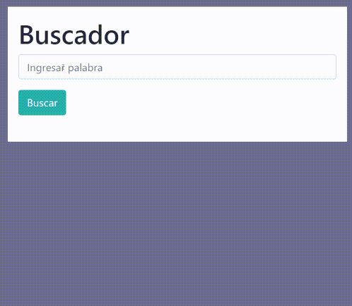

# Número Aleatorio

Buscador de palabras
## Probar app :  https://johanjimenex.github.io/numero-aleatorio/

### Vista previa




`Nota:`
He utilizado el framework de bootstrap.css para los estilos, recuerde descargar vincular el mismo:
`Bootstrap.css`

``` html
<link rel="stylesheet" href="bootstrap.css">
```

`html`
``` html
<!DOCTYPE html>
<html lang="es">

	<head>
		<meta charset="UTF-8">
		<meta name="viewport" content="width=device-width, initial-scale=1.0">
		<meta http-equiv="X-UA-Compatible" content="ie=edge">
		<link rel="stylesheet" href="bootstrap.css">
		<title>Document</title>
	</head>

	<body class="bg-secondary">

		<div class="container my-3 bg-light p-3 w-50">

			<h1>Buscador</h1>

			<form id="formulario">
				<input type="text" placeholder="Ingresar palabra" class="form-control my-2">
				<button class="btn btn-info my-2">Buscar</button>
			</form>

			<ul id="contenedor"></ul>

		</div>

		<script src="app.js"></script>
	</body>

</html>
```

`javascript`
``` javascript
'use strict'

let formulario = document.querySelector('#formulario');
let texto = document.querySelector('input');
let contenedor = document.querySelector('#contenedor');

let productos = [
    { nombre: 'platano', valor: 30 },
    { nombre: 'cebolla', valor: 10 },
    { nombre: 'tomate', valor: 10 },
    { nombre: 'pamela', valor: 10 },
    { nombre: 'canela', valor: 10 },
    { nombre: 'piña', valor: 10 },
    { nombre: 'coco', valor: 10 },
    { nombre: 'banana', valor: 10 },
    { nombre: 'quineo', valor: 10 },
]

// Event Listener
formulario.addEventListener('submit' || 'keyup', (e) => {
    e.preventDefault()

    let valor = texto.value.toLowerCase()
    filtrar(valor);
})

//funcion de flecha con un solo parametro
let filtrar = valor => {

    contenedor.innerHTML = '';

    for (let producto of productos) {

        if (producto.nombre.toLowerCase().includes(valor)) {

            contenedor.innerHTML += `
                <li>
                    Nombre: <b>${producto.nombre}</b>
                    Precio RD$:<b>${producto.valor}</b>
                </li>
            `
        }

    }
}
```